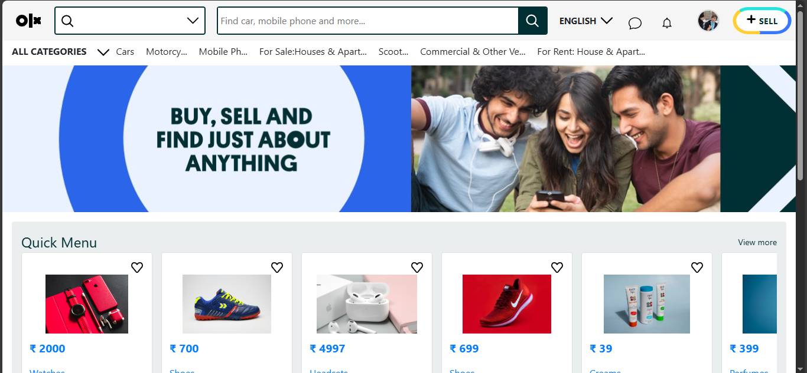

# OLX Clone - React Web App

 
 
  

A fully functional OLX-like web application built with **React**, **Firebase**, and **Supabase**. Users can sign up, log in, create product listings, upload images, and view products. The app supports **Email/Password authentication**, **Google Sign-In**, and dynamic user/product data storage.

---

## Features

- **User Authentication**
  - Email/Password signup and login
  - Google Sign-In
  - Profile updates

- **Product Management**
  - Create new product listings
  - Upload product images to Supabase storage
  - Store product details in Firestore

- **Dynamic Data**
  - Fetch and display products
  - Show seller details for each product
  - Real-time updates using Firebase

- **UI & UX**
  - Responsive design inspired by OLX
  - Loading states for async operations
  - Error and success messages

---

## Tech Stack

- **Frontend:** React, React Router, CSS
- **Backend & Database:** Firebase Firestore, Firebase Authentication
- **Storage:** Supabase Storage (for product images)
- **Authentication:** Firebase Auth, Google OAuth
- **Others:** React Icons, Custom Loading Component

---

## Usage

Signup/Login

- Users can register using Email/Password or Google Sign-In.

- Upon successful signup, the user profile is saved in Firestore.

Create Product

- Users can add product details: name, category, price, and image.

- Images are uploaded to Supabase storage and the product info is saved in Firestore.

View Products

- Products are dynamically displayed on the home page.

- Clicking a product shows detailed view with seller information fetched from Firestore.

Screenshot_home
---

## Screenshots

  
  
  
  

